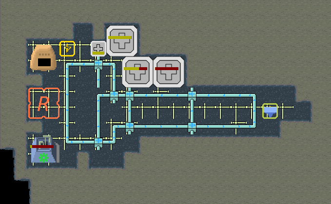

# Asteroid Colonies

A HTML5 game that you can build a colony in an asteroid.

In the colony, you can build excavator, smelter, assembler, residential areas and automate processing items.

Try it now on your browser!
https://msakuta.github.io/asteroid-colonies/

## What is this?

Asteroid Colonies is a HTML5 game that is similar to [FactorishWasm](https://github.com/msakuta/FactorishWasm), but targets online multiplayer game in a persistent universe.

**Note that the graphics are temporary!!** They are not finalized yet!



## Technologies

This project uses following technologies:

* Rust 1.74.1 (WebAssembly client and server build)
* node.js 16
* npm 8.3.1
* rollup 4.9.6

## Server synchronization

Running on Wasm client works, but the game state will be gone when you refresh the page or restart the browser.
We would like to save the game state in the server, and even run the simulation offline, so that when you come back after some time, the game has made progress while you were away.

However, we are still in early development stage, so we still keep the option to run the game entirely on the client side.
The only difference between client only simulation and the server backed simulation is that the server synchronization happens every few seconds.
[The deployed web page](https://msakuta.github.io/asteroid-colonies/) on GitHub works in client only simulation.

Currently, the server can synchronize a single asteroid colony, but it will expand in the future.

The server saves the game state to a file `save.json` at the working directory.

Note that [FactorishWasm](https://github.com/msakuta/FactorishWasm) used a different approach to save the game state, which is the browser's local storage, but its size is limited and you cannot synchronize among multiple devices easily.
One of the Asteroid Colonies project's goals is to achieve server state persistence.

## How to build web frontend

Install [Rust](https://www.rust-lang.org/tools/install).

Install node.js.

Install npm.

Depending on whether you want server synchronization, there are 2 ways to set environment variables.

* If you want server synchronization, set `SERVER_SYNC=true`
* Otherwise (no server synchronization), set `SERVER_SYNC=false` or unset it

Run

    npm run build

and the web page is deployed in `dist/`.


## How to run development server for wasm

Run

    npm run watch

Launch another terminal and run

    cd dist && npx serve

and browse http://localhost:3000/ for development.


## How to build the game server

Run

    cargo b --release -p asteroid-colonies-server

and it will build the binary in `target/release`.


## How to use a SSL certificate

The server is capable of hosting SSL connections for both HTTP and WebSocket,
which makes the protocol schema https and wss, respectively.

Probably the easiest way to create a self-signed certificate for testing
is to use [makecert](https://github.com/FiloSottile/mkcert).
After installing makecert, run the commands below to create a self-signed
Central Authority.

```
mkcert -install
mkcert -CAROOT
```

Then you can create a certificate with this command:

```
mkcert <hostname>
```

It will create a pair of a certificate and a private key.
`./<hostname>.pem` is the certificate and `./<hostname>-key.pem` is the private key.
You can run the server with these files like below.

```
asteroid-colonies-server --ssl-cert ./<hostname>.pem --ssl-priv-key ./<hostname>-key.pem
```

Note that the port is still the same (default 3883), but the protocol is now HTTPS.
It means you need to use an url like `https://<hostname>:3883/` to access from the browser.
If you don't supply `--ssl-cert` or `--ssl-priv-key`, the server will run with HTTP.


## How to build the debian package for the server

You can build a debian package that contains all the necessary assets for the server.
It is very combenient to deploy on a debian-based OS when the amount of memory is limited to build.

First, make sure the frontend is built with `SERVER_SYNC=true` in `dist/` directory with the instructions above.

Install [cargo-deb](https://crates.io/crates/cargo-deb).

    cargo install cargo-deb

Run

    cargo deb -p asteroid-colonies-server

and the debian package will be produced in `target/debian`.
Bring it to a deployment server and install it with

    apt install ./asteroid-colonies-server-*.deb

and you can run the command below to run the server.

    asteroid-colonies-server


## License

Licensed under either of

* Apache License, Version 2.0, ([LICENSE-APACHE](LICENSE-APACHE) or http://www.apache.org/licenses/LICENSE-2.0)
* MIT license ([LICENSE-MIT](LICENSE-MIT) or http://opensource.org/licenses/MIT)

at your option.

### Contribution

Unless you explicitly state otherwise, any contribution intentionally
submitted for inclusion in the work by you, as defined in the Apache-2.0
license, shall be dual licensed as above, without any additional terms or
conditions.
